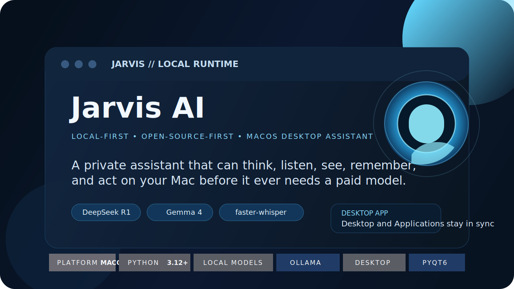
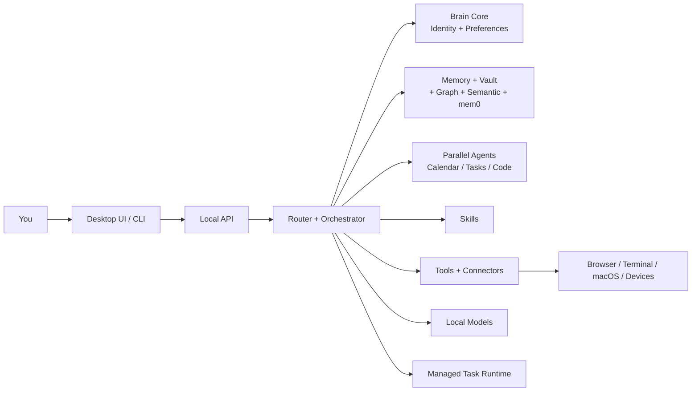

# <div align="center">Jarvis AI</div>

<div align="center">
  
</div>

<div align="center">

[](https://www.apple.com/macos/)
[](https://www.python.org/)
[](https://ollama.com/)
[](ui.py)
[](config.py)

</div>

Jarvis is a local-first desktop AI assistant for macOS.

The simple version:

- you talk to it
- it understands your request
- it looks up the right memory, tools, and context
- it answers or acts on your Mac

The ambitious version:

Jarvis is trying to become your own private, open-source-first desktop intelligence layer. Not just a chat box. Not just a prompt wrapper. A real system that can think, listen, see, remember, inspect code, control tools, and keep improving over time.

## Start Here

If you are new to this repo, read these sections in order:

1. `What Is Jarvis?`
2. `What's New (April 2026)`
3. `How Jarvis Works`
4. `Current State`
5. `Roadmap`
6. `Repo Map`

## What Is Jarvis?

Imagine a helpful robot friend living on your computer.

That friend should be able to:

- hear you
- talk back
- look at your screen
- remember important things
- help with coding
- use tools on your Mac
- stay private by running locally whenever possible

That is what Jarvis is meant to be.

For engineers, the more exact definition is:

Jarvis is a local-first assistant runtime with:

- a desktop app
- a local API
- model routing
- memory and retrieval
- skills, connectors, and plugins
- a managed task runtime
- multimodal perception
- local-model tuning and eval loops

## Why This Repo Exists

Most AI products today depend on cloud models as the foundation.

Jarvis is trying to invert that:

- local by default
- cloud only as fallback or explicit escalation
- grounded in your files, tools, and environment
- honest about what it knows and what it does not know

## What's New (April 2026)

Five major systems landed this month:

1. **Always-On Brain Core** — Loads your identity, projects, preferences, and roadmap from vault notes as a permanent system prefix. Every model call knows who you are and what Jarvis is for.
2. **Parallel Agent Layer** — ThreadPoolExecutor fan-out to specialized sub-agents for calendar, tasks, vault, code, and research. Commands: "brief me", "what's my status", "what needs my attention".
3. **mem0 Cross-Session Memory** — Ollama-embedded local Qdrant vector store. Persists conversation facts across sessions. Degrades silently when Ollama unavailable.
4. **Qwen3 Model Fleet** — Qwen3 8b (general), Qwen3 30b-a3b (near-GPT4), Devstral (coder), phi4-mini (fast). Join Deepseek R1 for reasoning work.
5. **4-Tier Memory System** — Vault (Obsidian brain) + graph context + semantic TF-IDF/embed + mem0 episodic. Parallel context sources in smart_stream.

## Jarvis In One Diagram



## How Jarvis Works

Every request follows roughly this path:

1. You ask Jarvis something.
2. Jarvis loads your identity from Brain Core.
3. Jarvis decides what kind of request it is.
4. Jarvis loads the right skills and context (4-tier memory system).
5. Jarvis chooses the right model and tools.
6. Jarvis can dispatch parallel agents if useful.
7. Jarvis answers, acts, or starts a managed task.
8. Jarvis stores useful memory for future sessions.

## The Main Systems

### 1. Desktop App

This is the visible Jarvis window and compact shell.

Main files:

- [main.py](main.py)
- [ui.py](ui.py)
- [desktop/](desktop)

What it does:

- shows the UI
- starts the local API/runtime
- lets you talk to Jarvis like a desktop product instead of a terminal script

### 2. Local API

This is the shared runtime surface that both the desktop app and CLI can talk to.

Main file:

- [api.py](api.py)

What it does:

- exposes chat, memory, runtime, task, skills, connectors, and plugin endpoints
- makes Jarvis act like a real local service instead of a one-off script

### 3. Router and Orchestrator

This is the decision-making layer before any model answers.

Main files:

- [router.py](router.py)
- [orchestrator.py](orchestrator.py)
- [model_router.py](model_router.py)

What it does:

- figures out what kind of request you made
- decides whether Jarvis should answer directly, use a skill, or start a task
- chooses the model path
- attaches relevant context first

### 4. Memory and Grounding

This is how Jarvis avoids feeling generic.

Main files:

- [memory.py](memory.py)
- [semantic_memory.py](semantic_memory.py)
- [vault.py](vault.py)
- [graph_context.py](graph_context.py)
- [mem0_layer.py](mem0_layer.py)

What it does:

- stores facts and preferences
- searches local markdown knowledge
- grounds repo questions in generated graph artifacts
- persists episodic memory across sessions via mem0
- gives Jarvis 4-tier parallel context across sessions

### 5. Always-On Brain Core

This is your identity snapshot baked into every model call.

Main file:

- [jarvis_core_brain.py](jarvis_core_brain.py)

What it does:

- loads Identity, Projects, Preferences, and Roadmap notes from vault at startup
- prepends a ~1400-char system context to every model call
- plays the same role for Jarvis that CLAUDE.md plays for Claude Code
- ensures every response knows who Aman is and what matters to you

### 6. Parallel Agent Layer

This is how Jarvis can multitask intelligently.

Main file:

- [jarvis_agents.py](jarvis_agents.py)

What it does:

- dispatches specialized sub-agents to calendar, tasks, vault, code, and research in parallel
- responds to meta-commands: "brief me", "morning briefing", "what's my status", "what needs my attention", "run agents on X"
- uses ThreadPoolExecutor to avoid blocking
- escalates complex queries to the main model when needed

### 7. mem0 Cross-Session Memory

This is episodic memory that persists across sessions.

Main file:

- [mem0_layer.py](mem0_layer.py)

What it does:

- Ollama-embedded, local Qdrant vector store at `~/.mem0/jarvis/`
- fourth parallel context source in smart_stream
- stores conversation facts and observations
- retrieves relevant past context automatically
- degrades silently if Ollama becomes unavailable

### 8. Skills, Connectors, and Plugins

This is Jarvis's extensibility layer.

Main files:

- [skills/](skills)
- [skills.py](skills.py)
- [connectors/index.json](connectors/index.json)
- [plugins/index.json](plugins/index.json)
- [extension_registry.py](extension_registry.py)

What each one means:

- `Skills`: instruction packs for specific types of work
- `Connectors`: integrations into real capabilities like browser, terminal, vault, and Google Workspace
- `Plugins`: bundles of skills, connectors, and agents that feel like complete features

### 9. Managed Task Runtime

This is the part that lets Jarvis act more like an operator than a chatbot.

Main files:

- [task_runtime.py](task_runtime.py)
- [jarvis_daemon.py](jarvis_daemon.py)
- [worktree_manager.py](worktree_manager.py)

What it does:

- registers named agents
- creates and tracks tasks
- streams task output
- prepares isolated code workspaces for code tasks

### 10. Voice, Meetings, Vision, and Device Awareness

This is the multimodal layer.

Main files:

- [voice.py](voice.py)
- [meeting_listener.py](meeting_listener.py)
- [camera.py](camera.py)
- [browser.py](browser.py)
- [hardware.py](hardware.py)

What it does:

- speech input
- speech output
- meeting assist
- screen and camera understanding
- browser control
- nearby device awareness

## Current State

Jarvis as of April 2026:

**Voice** — Kokoro TTS with macOS `say` fallback. Faster-whisper STT (upgrade path: large-v3-turbo).

**Memory** — 4-tier parallel: vault (Obsidian brain) + graph context + semantic TF-IDF/embed + mem0 episodic.

**Agents** — Parallel fan-out to calendar, tasks, vault, code, research with escalation detection.

**Brain** — Always-on identity snapshot from vault brain notes in every model call.

**Models** — Qwen3 fleet (4b/8b/30b-a3b), Devstral coder, Deepseek R1 reasoning, phi4-mini lightweight.

**Capability Overview** — Answer questions, explain concepts, plan work, read code, debug problems, remember facts/preferences/projects, ground answers in repo structure and vault, retrieve episodic memory across sessions, control browser/terminal, use skills and tools, create and manage tasks.

## Current Capability Overview

| Area | What Jarvis can do now |
|---|---|
| Chat | Answer questions, explain concepts, plan work, and reason about technical topics |
| Coding | Read the repo, explain code, debug problems, review code, and run managed coding tasks |
| Voice | Use local STT (faster-whisper) and local TTS (Kokoro → say fallback) in main path |
| Memory | 4-tier: vault, graph context, semantic embed, and mem0 episodic persistence |
| Brain | Always-on identity snapshot from vault notes in every model call |
| Agents | Parallel fan-out to calendar, tasks, vault, code, research with escalation |
| Repo grounding | Use Graphify and vault-based context instead of pure guesswork |
| Browser + system | Read pages, click controls, open apps, change settings, and take screenshots |
| Managed runtime | Inspect agents, create tasks, stream task output, and isolate code-task workspaces |
| Extensions | Expose discoverable skills, connectors, and plugins through API and CLI |

## Current Local Stack

Jarvis is configured around a local-first stack:

- **default local chat**: `qwen3:8b` (strong general-purpose)
- **near-GPT4 quality**: `qwen3:30b-a3b`
- **deeper reasoning**: `deepseek-r1:14b`
- **local coding**: `devstral`
- **fast lightweight**: `phi4-mini`
- **local STT**: `faster-whisper` (upgrade path: `large-v3-turbo`)
- **local TTS**: Kokoro with macOS `say` fallback
- **local embeddings**: `nomic-embed-text`
- **local vision**: `llava:7b`

You can inspect the live runtime stack with:

```bash
curl http://127.0.0.1:8765/local/capabilities
```

## Honest Current State

This project is strong enough to be useful now, but it is not done.

Important truth:

- Jarvis is local-first today
- Jarvis defaults to `open-source` mode, which keeps core inference on local models only
- paid fallbacks can still exist outside open-source mode for users who explicitly want them
- the remaining work is mostly about making every subsystem consistently local-quality, not re-centering the stack around cloud APIs

That honesty matters because the goal here is not marketing. The goal is to build the real thing.

## Architecture Roadmap

Jarvis is moving through a few clear stages.

### Phase 1: Stable Runtime

Goal:

Make Jarvis a real long-lived assistant runtime, not just a window that happens to call a model.

Main work:

- move more ownership into [jarvis_daemon.py](jarvis_daemon.py)
- keep [runtime_state.py](runtime_state.py) as the shared source of truth
- make UI and CLI act like clients of the runtime

### Phase 2: Strong Local Brain

Goal:

Make the default path local for chat, coding, speech, retrieval, and vision.

Main work:

- strengthen [model_router.py](model_router.py)
- keep local models as the main path
- reduce or remove cloud dependency from meeting, vision, and retrieval paths

### Phase 3: Better Grounding

Goal:

Make Jarvis answer from memory, repo structure, and real observations instead of fluent guessing.

Main work:

- improve [semantic_memory.py](semantic_memory.py)
- unify memory, vault, graph, and mem0 grounding
- add stronger retrieval and reranking

### Phase 4: Better Tools and Actions

Goal:

Let Jarvis act safely and reliably on the machine.

Main work:

- cleaner connector boundaries
- better verification for multi-step actions
- clearer safe vs privileged tool categories

### Phase 5: Multimodal Jarvis

Goal:

Make Jarvis feel like a real desktop assistant, not just a text engine.

Main work:

- better local meeting assist
- stronger local screen and camera understanding
- better device and environment awareness

### Phase 6: Self-Improving Jarvis

Goal:

Let Jarvis get better through evals and controlled local-model improvement.

Main work:

- stronger eval suites
- safer self-improvement loops
- better local-model training and promotion workflows

## Repo Map

If the repo feels big, this is the shortest useful map:

| Path | Purpose |
|---|---|
| [main.py](main.py) | App startup |
| [ui.py](ui.py) | Main desktop UI |
| [api.py](api.py) | Local API surface |
| [router.py](router.py) | Main request routing |
| [model_router.py](model_router.py) | Model choice and mode policy |
| [jarvis_core_brain.py](jarvis_core_brain.py) | Always-on identity snapshot |
| [jarvis_agents.py](jarvis_agents.py) | Parallel agent dispatcher |
| [mem0_layer.py](mem0_layer.py) | Cross-session episodic memory |
| [memory.py](memory.py) | Stored facts and profile memory |
| [semantic_memory.py](semantic_memory.py) | Retrieval over memory data |
| [vault.py](vault.py) | Local markdown knowledge vault |
| [graph_context.py](graph_context.py) | Repo graph grounding |
| [voice.py](voice.py) | Speech in and speech out |
| [meeting_listener.py](meeting_listener.py) | Meeting assist |
| [camera.py](camera.py) | Screen and camera understanding |
| [browser.py](browser.py) | Browser control |
| [hardware.py](hardware.py) | Mac and device awareness |
| [task_runtime.py](task_runtime.py) | Managed task system |
| [skills/](skills) | Skill packs |
| [connectors/](connectors) | Connector definitions |
| [plugins/](plugins) | Plugin definitions |
| [docs/jarvis_architecture/](docs/jarvis_architecture) | Architecture docs and roadmap |

## Extension Surface

Jarvis now exposes a Claude-style discovery layer:

```bash
./venv/bin/python jarvis_cli.py --skills
./venv/bin/python jarvis_cli.py --connectors
./venv/bin/python jarvis_cli.py --plugins
curl http://127.0.0.1:8765/extensions
```

## API Surface

Core runtime:

- `GET /status`
- `GET /runtime/state`
- `POST /chat`
- `GET /mode`
- `POST /mode`

Extensions:

- `GET /extensions`
- `GET /skills`
- `GET /skills/{skill_id}`
- `GET /connectors`
- `GET /connectors/{connector_id}`
- `GET /plugins`
- `GET /plugins/{plugin_id}`

OSINT local endpoints:

- `GET /osint/status`
- `POST /osint/username`
- `POST /osint/domain-typos`

Managed runtime:

- `GET /agents`
- `GET /tasks`
- `POST /tasks`
- `GET /tasks/{task_id}`
- `GET /tasks/{task_id}/events`
- `GET /tasks/{task_id}/stream`

Memory and vault:

- `GET /memory`
- `GET /memory/status`
- `POST /memory/add`
- `POST /memory/forget`
- `GET /vault`
- `POST /vault/build`

mem0 endpoints:

- `GET /mem0/status`
- `POST /mem0/add`
- `GET /mem0/search`

## CLI Examples

If `~/.local/bin` is on your `PATH`, use Jarvis like a console-native assistant:

```bash
jarvis
jarvis --doctor
jarvis --parity
jarvis --capability-evals
jarvis --security-roe ai
jarvis --code-ultra "inspect the auth middleware and propose the smallest safe patch"
```

The `jarvis` wrapper resolves the project venv before starting the daemon, so local dependencies such as `faster-whisper` stay available even if your shell's default `python3` points at Anaconda or another base interpreter.

```bash
./venv/bin/python jarvis_cli.py --status
./venv/bin/python jarvis_cli.py --skills
./venv/bin/python jarvis_cli.py --connectors
./venv/bin/python jarvis_cli.py --plugins
./venv/bin/python jarvis_cli.py "explain optimistic locking like I'm 10"
./venv/bin/python jarvis_cli.py --task "summarize the current repo architecture"
./venv/bin/python jarvis_cli.py --task-code "refactor the auth middleware"
./venv/bin/python jarvis_cli.py "brief me"
./venv/bin/python jarvis_cli.py "what needs my attention"
```

## Quick Start

### 1. Clone and create a venv

```bash
git clone https://github.com/amanimran786/jarvis-ai.git
cd jarvis-ai
python3 -m venv venv
source venv/bin/activate
pip install -r requirements.txt
```

### 2. Install and start Ollama

```bash
brew install ollama
brew services start ollama
```

### 3. Pull the recommended local models

```bash
ollama pull qwen3:8b              # strong general-purpose (recommended)
ollama pull qwen3:30b-a3b         # near-GPT4 quality on Mac
ollama pull deepseek-r1:14b       # reasoning and complex tasks
ollama pull devstral              # Mistral open coder
ollama pull phi4-mini             # fast lightweight responses
ollama pull nomic-embed-text      # embeddings for semantic search
ollama pull llava:7b              # vision model
```

### 4. (Optional) Install local OSINT tools

```bash
pip install maigret dnstwist
```

### 5. Run Jarvis

```bash
./run.sh
```

Headless:

```bash
./run.sh --no-ui
```

### 6. Build and install the desktop app

```bash
bash scripts/install_jarvis_app.sh
```

That rebuilds the latest packaged app and installs it to both:

- `Applications/Jarvis.app`
- `Desktop/Jarvis.app`

## Architecture Docs

For the deeper system docs, start here:

- [docs/jarvis_architecture/00_ARCHITECTURE.md](docs/jarvis_architecture/00_ARCHITECTURE.md)
- [docs/jarvis_architecture/02_MEMORY_ARCHITECTURE.md](docs/jarvis_architecture/02_MEMORY_ARCHITECTURE.md)
- [docs/jarvis_architecture/03_CAPABILITY_MODULES.md](docs/jarvis_architecture/03_CAPABILITY_MODULES.md)
- [docs/jarvis_architecture/05_OPEN_SOURCE_FIRST_ROADMAP.md](docs/jarvis_architecture/05_OPEN_SOURCE_FIRST_ROADMAP.md)
- [docs/jarvis_architecture/06_PROJECT_AUDIT_2026_04_09.md](docs/jarvis_architecture/06_PROJECT_AUDIT_2026_04_09.md)
- [docs/jarvis_architecture/07_MEMPALACE_GRAPHIFY_ADOPTION.md](docs/jarvis_architecture/07_MEMPALACE_GRAPHIFY_ADOPTION.md)
- [docs/persistent-jarvis-v1.md](docs/persistent-jarvis-v1.md)

Webhook hardening env vars: `JARVIS_WEBHOOK_MAX_AGE_SECONDS` and `JARVIS_PERSIST_REDACT_SOURCES` (see `docs/persistent-jarvis-v1.md`).

## Final Mental Model

If you remember only one thing, remember this:

Jarvis is not one model.

Jarvis is:

- a runtime
- a memory system
- a router
- a tool layer
- a desktop app
- an extension surface
- an always-on brain core
- a parallel agent dispatcher
- and a roadmap toward a real local AI assistant

The model is just one part inside that machine.
