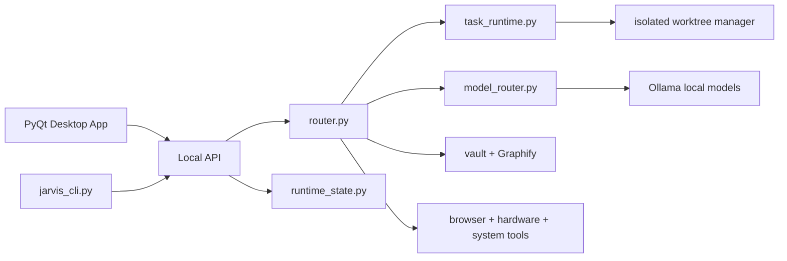

# <div align="center">Jarvis AI</div>

<div align="center">
  
</div>

<div align="center">

[](https://www.apple.com/macos/)
[](https://www.python.org/)
[](https://ollama.com/)
[](/Users/truthseeker/jarvis-ai/ui.py)
[](/Users/truthseeker/jarvis-ai/config.py)

</div>

Jarvis is a local-first desktop assistant for macOS. It is built to talk, listen, reason, remember, inspect your codebase, control your browser, and operate as a real desktop app before it ever needs a paid API.

The direction is simple:

- make the core path run locally
- keep cloud providers as optional fallback, not the foundation
- ship Jarvis as a real desktop product, not just a prompt loop

## Why Jarvis

Jarvis is aiming at a very specific experience: your own GPT-class desktop AI, running on your machine, grounded in your projects, and able to act across your Mac.

Today that means:

- local-first chat and reasoning with Ollama
- local STT with `faster-whisper`
- local TTS with macOS `say`
- local codebase grounding through Graphify artifacts
- a packaged desktop app that stays in sync in both `Applications` and `Desktop`
- managed task runtime, agent registry, and task lifecycle inspection

It also means being honest about the current state:

- the core open-source path is real and usable now
- some subsystems still keep paid fallbacks available
- the project is actively moving those remaining paths to stronger local replacements

## What It Can Do

| Area | Current capability |
|---|---|
| Chat + reasoning | Local-first conversation, planning, debugging, architecture, and technical Q&A |
| Coding | Local coder model routing, code-review paths, repo-aware answers, task runtime, and CLI execution |
| Voice | Local speech-to-text, local text-to-speech, wake-word flow, and meeting-assist plumbing |
| Memory | Persistent facts, preferences, projects, recent conversations, and tiered memory inspection |
| Repo grounding | Graphify-powered codebase context and local vault-based retrieval |
| Browser + Mac | Open sites, inspect current page, click visible controls, launch apps, change volume, take screenshots |
| Desktop app | PyQt6 UI, meeting toolbar, compact shell, packaged `Jarvis.app`, Desktop launcher |
| Agents + runtime | Managed tasks, streamed task output, isolated code-task workspaces, agent/task inspection endpoints |

## Local Stack

Jarvis is configured around a local-first model stack:

- default local chat: `gemma4:e4b`
- local reasoning: `deepseek-r1:14b`
- local coding: `qwen2.5-coder:7b`
- local STT: `faster-whisper`
- local TTS: macOS `say`
- local embeddings: `nomic-embed-text`
- local vision path available: `llava:7b` when installed

You can inspect the live local stack at runtime with:

```bash
curl http://127.0.0.1:8765/local/capabilities
```

If Jarvis moves to a different port because `8765` is taken, the packaged app and CLI now discover that automatically.

## Quick Start

### 1. Clone and create a venv

```bash
git clone https://github.com/amanimran786/jarvis-ai.git
cd jarvis-ai
python3 -m venv venv
source venv/bin/activate
pip install -r requirements.txt
```

### 2. Install and start Ollama

```bash
brew install ollama
brew services start ollama
```

### 3. Pull the recommended local models

```bash
ollama pull gemma4:e4b
ollama pull deepseek-r1:14b
ollama pull qwen2.5-coder:7b
ollama pull nomic-embed-text
```

Optional local vision:

```bash
ollama pull llava:7b
```

### 4. Run Jarvis

```bash
# GUI mode
./run.sh

# Headless mode
./run.sh --no-ui
```

### 5. Build and install the desktop app

```bash
bash scripts/install_jarvis_app.sh
```

That one command rebuilds the latest packaged app and installs it to:

- `/Users/truthseeker/Applications/Jarvis.app`
- `/Users/truthseeker/Desktop/Jarvis.app`

So the Desktop icon and the Applications copy stay current with the latest build.

## Desktop App Flow

Jarvis now has a cleaner packaged-app path:

- the app is built as a proper macOS `onedir` bundle
- the Desktop launcher is a full app bundle, not a fragile symlink
- the packaged app is protected from conda GUI-launch issues
- the CLI discovers the live app port dynamically, even if `8765` is occupied

That means this works reliably:

```bash
open -na /Users/truthseeker/Desktop/Jarvis.app
./venv/bin/python jarvis_cli.py --status
```

## Modes

Jarvis supports multiple routing modes:

- `open-source` — local/open tooling only on the main path
- `local` — prefer local models
- `auto` — route based on task complexity and policy
- `cloud` — prefer cloud providers

The default mode is `open-source`.

You can switch modes in-app or by request:

- `switch to open-source mode`
- `switch to local mode`
- `switch to auto mode`
- `switch to cloud mode`

## Runtime API

Jarvis exposes a local HTTP API while running.

### Core

- `GET /status`
- `GET /runtime/state`
- `GET /mode`
- `POST /mode`
- `POST /chat`

### Local runtime inspection

- `GET /local/capabilities`
- `GET /local/training/status`
- `GET /local/evals/status`
- `GET /local/automation/status`
- `GET /local/beta/status`

### Memory and retrieval

- `GET /memory`
- `GET /memory/status`
- `POST /memory/add`
- `POST /memory/forget`
- `POST /memory/consolidate`
- `GET /vault`
- `POST /vault/build`

### Managed runtime

- `GET /agents`
- `GET /tasks`
- `POST /tasks`
- `GET /tasks/{task_id}`
- `GET /tasks/{task_id}/events`
- `GET /tasks/{task_id}/stream`

## CLI

While Jarvis is running, you can talk to it from the terminal:

```bash
./venv/bin/python jarvis_cli.py --status
./venv/bin/python jarvis_cli.py what's the fastest way to debug a FastAPI 502?
./venv/bin/python jarvis_cli.py --task "summarize the current repo architecture"
./venv/bin/python jarvis_cli.py --task-code "refactor the auth middleware"
```

The CLI now resolves the live app endpoint per request, so it stays aligned with the packaged app after restarts and port fallback.

## Repo Grounding

Jarvis can answer questions about this codebase using prebuilt Graphify artifacts instead of rereading raw files every time.

To build the graph:

```bash
venv/bin/python -m pip install graphifyy
venv/bin/python scripts/build_graphify_repo.py
```

That generates:

- `graphify-out/graph.json`
- `graphify-out/GRAPH_REPORT.md`
- `graphify-out/analysis.json`

## Skills, Agents, and Tasks

Jarvis is moving away from one giant always-loaded prompt and toward a managed runtime:

- `skills/` contains lightweight skill metadata plus deeper `SKILL.md` instructions
- `agents/` contains specialist role definitions
- the task runtime manages agent registration, task state, task streaming, and isolated workspaces for code tasks

Current built-in specialist roles include:

- `planner`
- `executor`
- `reviewer`
- `science_expert`
- `security_reviewer`
- `self_improve_critic`

## Architecture



High-leverage modules:

- `main.py` — boot path, GUI/runtime startup, crash logging
- `ui.py` — desktop app UI
- `api.py` — local HTTP surface
- `jarvis_daemon.py` — daemon bootstrap
- `runtime_state.py` — live runtime metadata and endpoint discovery
- `task_runtime.py` — managed tasks, agents, streams
- `model_router.py` — model selection
- `brains/brain_ollama.py` — local inference, capability discovery, model warmup
- `voice.py` — local-first STT/TTS path
- `router.py` — user intent routing and fast paths

## Repository Layout

The repo is intentionally split by responsibility so the root stays readable:

- `brains/` — model-provider adapters and local inference backends
- `desktop/` — dock, overlay, hotkey, bridge, and screenshot helpers
- `local_runtime/` — local eval, training, benchmark, STT, and TTS helpers
- `skills/` — specialist prompts, playbooks, and activation metadata
- `docs/` — architecture notes, roadmap, and audits
- `scripts/` — build, install, icon, graph, and maintenance scripts
- `tests/` — regression, runtime, and packaging checks
- repo root — the main runtime entrypoints and app subsystems

If you are orienting quickly, start with:

- `main.py`
- `ui.py`
- `api.py`
- `router.py`
- `model_router.py`
- `desktop/overlay.py`
- `brains/brain_ollama.py`
- `task_runtime.py`

## macOS Permissions

Depending on what you use, Jarvis may request:

- Accessibility
- Automation
- Microphone
- Camera
- Screen Recording

These are normal for the desktop-control, voice, meeting, and screen-analysis features.

## Optional Cloud Fallbacks

Jarvis keeps paid providers available as fallback, but they are no longer the center of the system.

If you want that fallback path available, add a `.env` file with only the providers you want:

```env
OPENAI_API_KEY=
ANTHROPIC_API_KEY=
ELEVENLABS_API_KEY=
```

If you leave those unset, the main local path still works.

## Current Development Direction

The current push is:

- make the desktop app path reliable
- keep the core assistant usable with zero API cost
- strengthen local vision and local memory quality
- keep the Desktop app and Applications app updated together
- improve the managed-agent runtime so Jarvis feels like a real desktop coworker

## Contributing

If you are working on Jarvis locally:

```bash
./venv/bin/python -m py_compile main.py api.py jarvis_cli.py
./venv/bin/python -m unittest tests.test_jarvis_regression_suite
```

For packaged-app changes, rebuild and reinstall with:

```bash
bash scripts/install_jarvis_app.sh
```

## North Star

Jarvis is being built toward one simple goal:

> a private, open-source-first desktop AI that feels closer to a real teammate than a chat tab
