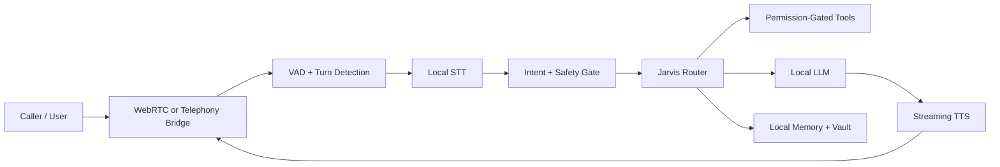

# Assistant Tech Research Backlog

Purpose: turn current open-source assistant patterns into safe, local-first Jarvis upgrades.

Updated: 2026-04-26

## Priority 0 - Messaging Reliability

Jarvis should treat Messages as a deterministic state machine, not as a general chat problem.

- Add a first-class conversation event model: `incoming`, `draft`, `confirmed_send`, `sent`, `failed`, `canceled`, `contact_ambiguous`.
- Keep a per-contact thread cache keyed by resolved phone/email, not only display name.
- Never let a general model claim a message was sent. Only `messages.send_imessage()` can create a sent state.
- Support inline commands: `reply to Aman saying ...`, `respond to Aman with ...`, `ask Aman if ...`.
- Resolve contact ambiguity before drafting long content when possible, but do not block draft creation when the contact is clear enough.

Reference pattern: `imessage-mcp-server` uses AppleScript-backed contact search plus local Messages send tools. Useful pieces are `search_contacts`, `send_message`, and explicit macOS permission troubleshooting.

Source: https://github.com/marissamarym/imessage-mcp-server

## Priority 1 - Voice And Calls

Jarvis should not start by owning phone calls directly. Build the voice stack in this order:

1. Improve local turn-taking and interruption handling in the existing desktop voice loop.
2. Add WebRTC voice session support for browser/mobile testing.
3. Add optional telephony bridge only after local voice is stable.

Best fit patterns:

- LiveKit Agents: production-grade realtime voice agents, semantic turn detection, WebRTC clients, telephony support, MCP support, and tests.
- Pipecat: Python-native realtime voice/multimodal pipelines with STT/TTS/transport swaps, subagents, structured flows, WhatsApp transport, local transport, and debugging tools.
- FastRTC: smaller Python WebRTC layer with automatic voice detection, built-in UI, FastAPI mounting, and phone-call demo path.
- Dograh: self-hostable voice-agent platform with drag-and-drop call workflows, Twilio support, and test personas. Better as architecture reference than direct dependency for Jarvis.

Sources:

- https://github.com/livekit/agents
- https://github.com/pipecat-ai/pipecat
- https://github.com/freddyaboulton/gradio-webrtc
- https://github.com/dograh-hq/dograh

## Priority 2 - Local Answering Service

The safest "answer calls" MVP is not full autonomous calling. It is conditional call forwarding to a Jarvis answering service that:

- Clearly says it is Aman's AI assistant.
- Captures caller name, reason, urgency, and callback number.
- Sends Aman a summary notification.
- Never promises actions without explicit Aman approval.
- Uses prompt-injection hardening because callers are untrusted input.

Reference pattern: HAL answering service uses Faster-Whisper, a local LLM, streaming TTS, pre-recorded greetings, webhook validation, input truncation, and push summaries.

Source: https://github.com/ninjahuttjr/hal-answering-service

## Priority 3 - Gateway And Skills

Jarvis already has a local daemon and skills. The OpenClaw-style pattern worth adapting is not the hype layer; it is the gateway boundary.

Useful pieces:

- One local gateway for channels: CLI, desktop, web UI, Messages, email, future voice.
- Explicit channel adapters normalize events into one internal event schema.
- Skills are installable units, but treated as trusted code requiring review.
- Workspace memory is file-based and local-first.
- Daemon install/startup path is part of product quality, not an afterthought.

Security note: third-party skills/plugins are executable code. Jarvis should ingest patterns, not blindly install skills.

Source: https://github.com/openclaw/openclaw

## Priority 4 - Gmail And Email

Current blocker: Google auth can expire or revoke. Fix auth durability before adding smarter email agents.

Next steps:

- Move Google token storage to a stable Application Support path for packaged app.
- Add explicit "reauthorize Gmail" flow in Jarvis UI/CLI.
- Keep all email sends confirmation-gated.
- Consider MCP-style interface only after native auth and confirmation are reliable.

Reference pattern: Gmail MCP servers support multi-account read/write and encrypted token storage, but Jarvis should first stabilize its own native Gmail integration.

Source: https://github.com/navbuildz/gmail-mcp-server

## Priority 5 - Production Voice Architecture

Use this architecture if Jarvis grows into calls:

Rules:

- Turn detection is a first-class component.
- Tool calls are always permission-gated.
- Untrusted inbound messages/calls are never allowed to rewrite system instructions.
- "Sent" and "done" states must come from tool results, not model text.

